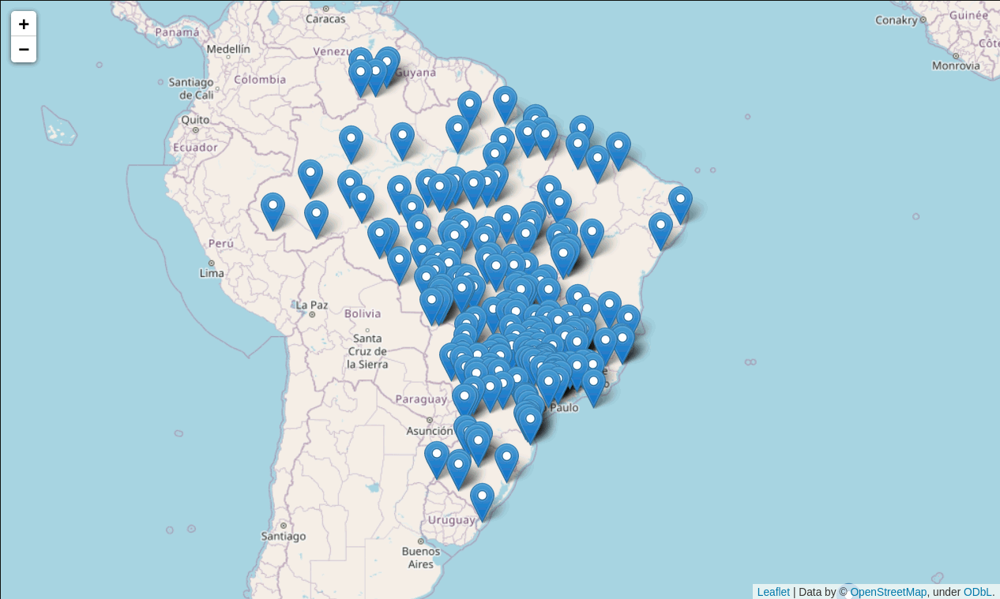

# Exploring aircraft accidents in Brazil

Occurrencies with aircraft in Brazil are investigated by the Center for
Investigation and Prevention of Aircraft Accidents (*Centro de
Investigação e Prevenção de Acidentes Aeronáuticos* – Cenipa). Which is
then released as
[open data](https://dados.gov.br/dataset/ocorrencias-aeronauticas-da-aviacao-civil-brasileira)
and updated on a yearly basis.

This repository contains Jupyter Notebooks for exploring that data.

## Sample output

Here are some sample charts produced by the notebooks.

## How to use

To use the Jupyter Notebooks you need either Jupyter Notebook or
Jupyter Lab, with the
[Jupytext](https://jupytext.readthedocs.io/en/latest/) extension
installed.

For ease of use, you might want to use my Docker-based
[docker-jupyter-extensible](https://github.com/augusto-herrmann/docker-jupyter-extensible),
which comes with everything needed already configured.

## Why Jupytext

Why am I using Jupytext instead of `.ipynb` files? Because those are
very large json files that do not fit well with the line by line version
control offered by Git. And I want to track changes to the notebooks.
With Jupytext, I can keep the notebooks under version control and the
`.ipynb` files are automatically generated every time the `.py` files
are changed and vice versa.
